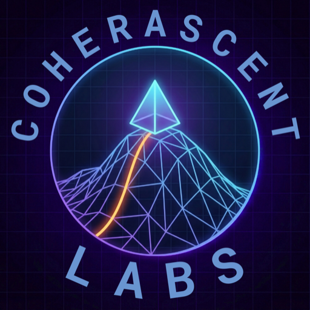

# Coherascent Labs



An experimental multi-page marketing site for Coherascent Labs, built as a static website with custom HTML, CSS, and JavaScript.

The site presents Coherascent as a dual-pillar organization:
- `Research`: neuro-symbolic, deterministic, and truth-aligned AI work
- `Applied`: educational product concepts for handwritten reasoning, grading, and adaptive learning

## Live Structure

The current route structure is directory-based:

| Route | Purpose |
| --- | --- |
| `/` | Main landing page |
| `/research/` | Research overview and technical program |
| `/applied/` | Applied technology and product experience |

Legacy compatibility stubs still exist:
- `research.html` redirects to `/research/`
- `applied.html` redirects to `/applied/`

## What’s In The Site

### Home
- dual-pillar hero and brand framing
- interactive `Tower of Hanoi` demo
- interactive orbital canvas scene
- theme toggle with persisted preference via `localStorage`

### Research
- long-form research overview
- initiative cards and technical visuals
- shared brand/theme system with a purple-biased research starfield

### Applied
- notepad-style `Platform Components` showcase
- animated handwritten-response slideshow
- synchronized question-phone UI
- `Screenshot Workflow` phone sequence for capture, grading, and feedback
- `Voice Upload` concept section
- shared phone rendering system with consistent proportions, hardware buttons, and theme-aware UI

## Stack

This repo intentionally stays simple:

- plain `HTML`
- custom `CSS` embedded per page
- plain `JavaScript`
- no framework
- no bundler
- no build step

Fonts are loaded from Google Fonts and the site uses local images, SVGs, and handwritten animation scripts.

## Local Development

Because the project uses directory routes like `/research/` and `/applied/`, run it from a static server at the repo root instead of opening the files directly.

```bash
cd /Users/griffinrutherford/Documents/coherascent-labs
python3 -m http.server 8000
```

Then open:

- `http://localhost:8000/`
- `http://localhost:8000/research/`
- `http://localhost:8000/applied/`

## Project Map

```text
.
├── index.html
├── research/
│   └── index.html
├── applied/
│   └── index.html
├── research.html                  # redirect stub
├── applied.html                  # redirect stub
├── applied-response-slideshow.js # response carousel logic
├── applied-handwriting-demo.js   # animated handwriting SVG logic
├── images/                       # research visuals
├── mobile-app-plan.md           # app implementation plan
└── mobile-app-assets/           # tokens, icons, UML diagrams
```

## Key Interaction Notes

### Theme system
- all three pages share the same `coherascent-theme` localStorage key
- each page has its own starfield treatment tuned to the page’s visual role
- the applied page also has theme-aware phone UI states

### Handwriting system
- the applied slideshow reveals handwriting line-by-line and character-by-character
- word wrapping is precomputed so words do not jump awkwardly to a new line mid-write
- reduced-motion users get a stable static rendering instead of the full animation sequence

### Phone mockups
- workflow phones use shared sizing variables
- phone proportions are normalized across breakpoints
- the applied page includes consistent shell geometry, camera island treatment, and side hardware buttons

## Related Docs

- [Mobile App Plan](mobile-app-plan.md)
- [Mobile App Assets](mobile-app-assets/README.md)

Those docs capture the native-app translation path, asset organization, tokens, and UML diagrams for turning the web mockups into a real iOS/Android product.

## Notes

- `index-vibe.html` is a sidecar concept file and not part of the main directory-routed site
- some favicon source assets are kept separately from the currently used favicon files
- the site is optimized as a polished static experience, not as a CMS-backed marketing stack

## Next Good Improvements

- extract the shared theme script into a single reusable file
- extract the shared starfield/phone CSS into reusable assets instead of duplicating per page
- add a tiny local dev script or simple static-server config
- add visual regression screenshots for the main breakpoints
