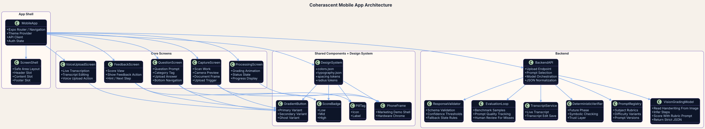

# Mobile App Plan

As of March 23, 2026, the best default path for this app is `React Native + Expo`.

## Why

- One `TypeScript` codebase can target both `iOS` and `Android`.
- Expo is built for shipping one project across both platforms with native behavior.
- It is the fastest path from polished UI renders to a real product if the team already thinks in components, layout systems, and frontend-style workflows.
- If deeper native control is needed later, Expo supports `prebuild` instead of forcing a rewrite.

Sources:
- https://docs.expo.dev/
- https://docs.expo.dev/tutorial/create-your-first-app/
- https://docs.expo.dev/workflow/prebuild

## Recommended Build Steps

1. Turn the renders into a real design system first.
   Do not try to convert screenshots directly into code.
   Rebuild them as reusable components such as:
   - `PhoneFrame`
   - `QuestionCard`
   - `CaptureScreen`
   - `ProcessingScreen`
   - `FeedbackScreen`
   - buttons
   - pills
   - nav
   - spacing tokens
   - color tokens

2. Start a real app with Expo.
   Create the project with:

   ```bash
   npx create-expo-app@latest
   ```

   Then build each screen in React Native.

   Source:
   - https://docs.expo.dev/tutorial/create-your-first-app/

3. Add navigation and flows.
   Build actual app flows for:
   - capture/upload
   - processing
   - feedback
   - voice upload
   - question view
   - low-confidence retry states

4. Add native capabilities only when needed.
   Use Expo and React Native libraries first for:
   - camera
   - file upload
   - permissions
   - notifications
   - device integrations

   If something needs deeper native access, use:

   ```bash
   npx expo prebuild
   ```

   Sources:
   - https://docs.expo.dev/workflow/expo-cli/
   - https://docs.expo.dev/workflow/prebuild/
   - https://docs.expo.dev/guides/permissions/

5. Test on both platforms continuously.
   Local native runs:

   ```bash
   npx expo run:ios
   npx expo run:android
   ```

   Source:
   - https://docs.expo.dev/workflow/expo-cli/

## MVP Architecture

For the MVP, do not build a custom OCR-first pipeline.

Use this path instead:

1. Student photographs handwritten work in the app.
2. The mobile app uploads the image to a thin backend orchestrator.
3. The backend selects the correct rubric prompt by subject and difficulty.
4. The backend sends the image plus prompt to a vision-capable language model.
5. The model returns strict JSON, not conversational text.
6. The backend validates the JSON, applies confidence rules, and returns a normalized response to the app.
7. The app renders score, feedback, retry states, and next actions.

### MVP Request / Response Shape

The model should return a structured object with fields like:

```json
{
  "transcription": "student work as read from the page",
  "inferred_steps": [
    {
      "index": 1,
      "text": "student step",
      "status": "correct"
    }
  ],
  "score": 0.84,
  "error_location": {
    "step_index": 3,
    "reason": "distribution error"
  },
  "feedback": [
    "Explain what was correct",
    "Explain what broke",
    "Give the next correction"
  ],
  "confidence": 0.78,
  "fallback_state": "gradeable"
}
```

### Non-Negotiable MVP Rules

- Do not accept free-form grading text from the model.
- Every grading path should use a versioned rubric prompt.
- Low-confidence responses should trigger retry or fallback UI, not a confident score.
- The backend should validate schema shape before returning anything to the app.
- Deterministic verification is phase 2, not phase 1.

### Prompt / Rubric Strategy

Use separate prompt packs by subject and level:

- elementary arithmetic
- algebra
- calculus
- proof / algorithms
- standardized test prep
- medical / science explanation

Each pack should define:

- expected answer style
- acceptable step structure
- scoring rubric
- feedback tone
- confidence downgrade conditions

### Backend Responsibilities

The backend should stay thin but disciplined:

- store image uploads
- select prompt versions
- call the model API
- validate structured output
- apply confidence thresholds
- log prompt version, score, confidence, and corrected outcomes

### Phase Split

- `Phase 1`
  - image upload
  - vision model grading
  - structured JSON
  - confidence + retry states
  - real-user eval set
- `Phase 2`
  - deterministic verification
  - symbolic checking for subjects where it is feasible
  - research-driven trust layer
  - stronger auditability and proof of correctness

## UML Overview



PlantUML source:
- `mobile-app-assets/diagrams/app-architecture-uml.puml`

If your markdown viewer supports Mermaid, the editable source version is below:

```mermaid
classDiagram
  class MobileApp {
    +Expo Router / Navigation
    +Theme Provider
    +API Client
    +Auth State
  }

  class ScreenShell {
    +Safe Area Layout
    +Header Slot
    +Content Slot
    +Footer Slot
  }

  class CaptureScreen {
    +Scan Work
    +Camera Preview
    +Document Frame
    +Upload Trigger
  }

  class ProcessingScreen {
    +Grading Animation
    +Status State
    +Progress Display
  }

  class FeedbackScreen {
    +Score View
    +Show Feedback Action
    +Hint / Next Step
  }

  class VoiceUploadScreen {
    +Live Transcription
    +Transcript Editing
    +Voice Upload Action
  }

  class QuestionScreen {
    +Question Prompt
    +Category Tag
    +Upload Answer
    +Bottom Navigation
  }

  class DesignSystem {
    +colors.json
    +typography.json
    +spacing tokens
    +radius tokens
  }

  class GradientButton {
    +Primary Variant
    +Secondary Variant
    +Ghost Variant
  }

  class PillTag {
    +Icon
    +Label
  }

  class ScoreBadge {
    +Low
    +Mid
    +High
  }

  class PhoneFrame {
    +Marketing Demo Shell
    +Hardware Chrome
  }

  class BackendAPI {
    +Upload Endpoint
    +Prompt Selection
    +Model Orchestration
    +JSON Normalization
  }

  class PromptRegistry {
    +Subject Rubrics
    +Difficulty Variants
    +Prompt Versions
  }

  class VisionGradingModel {
    +Read Handwriting From Image
    +Infer Steps
    +Score With Rubric Prompt
    +Return Strict JSON
  }

  class ResponseValidator {
    +Schema Validation
    +Confidence Thresholds
    +Fallback State Rules
  }

  class EvaluationLoop {
    +Benchmark Samples
    +Prompt Quality Tracking
    +Human Review For Misses
  }

  class TranscriptService {
    +Live Transcript
    +Transcript Edit Save
  }

  class DeterministicVerifier {
    +Future Phase
    +Symbolic Checking
    +Trust Layer
  }

  MobileApp --> ScreenShell
  MobileApp --> CaptureScreen
  MobileApp --> ProcessingScreen
  MobileApp --> FeedbackScreen
  MobileApp --> VoiceUploadScreen
  MobileApp --> QuestionScreen
  MobileApp --> BackendAPI
  MobileApp --> DesignSystem

  CaptureScreen --> GradientButton
  CaptureScreen --> PhoneFrame
  ProcessingScreen --> PhoneFrame
  FeedbackScreen --> ScoreBadge
  FeedbackScreen --> GradientButton
  VoiceUploadScreen --> GradientButton
  QuestionScreen --> PillTag
  QuestionScreen --> GradientButton

  DesignSystem --> GradientButton
  DesignSystem --> PillTag
  DesignSystem --> ScoreBadge
  DesignSystem --> PhoneFrame

  BackendAPI --> PromptRegistry
  BackendAPI --> VisionGradingModel
  BackendAPI --> ResponseValidator
  BackendAPI --> EvaluationLoop
  BackendAPI --> TranscriptService
  BackendAPI --> DeterministicVerifier
```



## Design Spec

This section is the practical translation layer from the website mockups into real mobile UI components.

### Visual Direction

- Overall look: `space-themed`, `premium`, `truth-tech`, `dark glass UI`
- Mood: serious, futuristic, academic, not playful
- Core contrast: dark surfaces with glowing blue, violet, and red highlights
- Motion style: subtle orbital movement, soft glow drift, loading pulses, no noisy animation spam
- Material language:
  - metal phone shell
  - dark OLED-like screens
  - glassy overlays
  - soft cosmic gradients
  - rounded pills and rounded cards

### Core Color Tokens

Use these as the base design tokens in the real app:

```ts
export const colors = {
  bg: "#000000",
  bgDeep: "#000000",
  surface: "rgba(8, 17, 34, 0.72)",
  surfaceStrong: "#0c162a",
  surfaceElevated: "#101c36",
  line: "rgba(164, 123, 255, 0.20)",
  text: "#edf5ff",
  textMuted: "#a6bad7",
  blue: "#64a8ff",
  purple: "#a47bff",
  red: "#ff5d87",
  cyan: "#64a8ff",
  success: "#7cf7ff",
  warning: "#ffad5c",
  lowScore: "#ff5d87",
  midScore: "#a47bff",
  highScore: "#64a8ff",
};
```

Reference file:
- [mobile-app-assets/tokens/colors.json](/Users/griffinrutherford/Documents/coherascent-labs/mobile-app-assets/tokens/colors.json)

### Exact Color Assignments

Use these exact values by role:

- `App background`
  - base: `#000000`
  - deep shadow: `#050914`
  - hero surface top: `#0B162C`
  - hero surface bottom: `#070E1D`
- `Screen surfaces`
  - surface base: `#081122`
  - strong surface: `#0C162A`
  - elevated surface: `#101C36`
  - question screen gradient stops:
    - `#141028`
    - `#0A0E1C`
    - `#070D1A`
- `Primary text`
  - main: `#EDF5FF`
  - secondary: `#C6D9F5`
  - muted: `#A6BAD7`
- `Brand accents`
  - blue: `#64A8FF`
  - purple: `#A47BFF`
  - red: `#FF5D87`
  - cyan: `#7CF7FF`
  - orange: `#FFAD5C`
- `Feedback states`
  - low: `#FF5D87`
  - medium: `#A47BFF`
  - high: `#64A8FF`
- `Borders and dividers`
  - standard line: `rgba(164, 123, 255, 0.20)`
  - metal edge line: `rgba(196, 208, 228, 0.16)`
  - soft bezel line: `rgba(255, 255, 255, 0.04)`
- `Glow values`
  - blue glow: `rgba(100, 168, 255, 0.14)`
  - purple glow: `rgba(164, 123, 255, 0.14)`
  - red glow: `rgba(255, 93, 135, 0.14)`

Recommended exact component mappings:

- `Primary CTA`
  - gradient:
    - `#FF5D87`
    - `#A47BFF`
    - `#64A8FF`
  - label: `#EDF5FF`
- `Secondary pill`
  - fill: `rgba(255, 255, 255, 0.05)`
  - border: `rgba(164, 123, 255, 0.24)`
  - text: `rgba(226, 238, 255, 0.84)`
- `Dark content card`
  - top: `#0B162C`
  - bottom: `#070E1D`
  - border: `rgba(164, 123, 255, 0.20)`
- `Phone metal band`
  - top highlight mix: `rgba(110, 124, 150, 0.96)`
  - mid body: `rgba(36, 45, 64, 0.98)`
  - dark body: `rgba(12, 16, 26, 0.99)`
  - lower body: `rgba(24, 34, 50, 0.98)`

### Expanded Color System

Use the palette in layers instead of as isolated swatches:

- `Base background`
  - pure black and near-black only
  - avoid medium gray app backgrounds
- `Primary surfaces`
  - deep navy surfaces for cards and screens
  - these should hold most of the UI
- `Accent lighting`
  - blue for intelligence, precision, and progress
  - purple for abstraction, reasoning, and system depth
  - red for energy, urgency, and emotional warmth
- `Text hierarchy`
  - almost-white for primary text
  - cool desaturated blue-gray for secondary text
  - muted blue-gray for low-emphasis metadata

Practical usage ratios:

- `70-75%` dark base / neutral surface
- `15-20%` blue and purple accents
- `5-10%` red accent
- red should usually be the smallest accent, not the dominant fill

Recommended component-level color behavior:

- hero and shell surfaces:
  - black to navy gradients
- question and content screens:
  - blue/purple dominant with controlled red bloom
- low-score feedback:
  - red/orange accents over dark violet-black
- mid-score feedback:
  - purple/blue dominant
- high-score feedback:
  - cyan/blue dominant
- pills:
  - dark translucent base
  - subtle gradient tint
  - border brighter than fill
- buttons:
  - stronger gradient than cards
  - white text
  - darker outer shadow than inner glow

Avoid:

- flat saturated red backgrounds
- light pastel screens
- generic white cards unless intentionally simulating paper
- overusing cyan on every single component

### Gradient Recipes

These are the main gradient patterns to reuse:

- App background:
  - `radial-gradient` blue glow from top-left
  - `radial-gradient` purple glow from upper-right
  - `radial-gradient` red glow from lower area
  - black-to-black vertical base

- Card background:
  - dark navy gradient from top to bottom
  - faint blue/purple/red radial bloom at corners

- Active pill / button:
  - `linear-gradient(145deg, red -> purple -> blue)`

- Loading planet:
  - bright white core
  - blue outer glow
  - purple mid ring
  - red accent at the rim

Suggested implementation order for gradients:

1. vertical dark base
2. large radial color bloom
3. smaller secondary bloom
4. very subtle white sheen
5. optional star field

Exact gradient examples:

```ts
export const gradients = {
  heroSurface: ["#0B162C", "#070E1D"],
  appScreen: ["#141028", "#0A0E1C", "#070D1A"],
  primaryAccent: ["#FF5D87", "#A47BFF", "#64A8FF"],
  feedbackLow: ["#FF5D87", "#FFAD5C"],
  feedbackMid: ["#A47BFF", "#64A8FF"],
  feedbackHigh: ["#7CF7FF", "#64A8FF"],
};
```

### Spacing Tokens

```ts
export const spacing = {
  xs: 4,
  sm: 8,
  md: 12,
  lg: 16,
  xl: 24,
  xxl: 32,
};
```

Use `24` as the default screen padding and `12` as the default gap inside small cards and phones.

### Radius Tokens

```ts
export const radius = {
  sm: 8,
  md: 12,
  lg: 16,
  xl: 24,
  pill: 999,
};
```

### Typography

Recommended mobile stack:

- Display / headings:
  - primary: `Space Mono`
  - fallback: `IBM Plex Mono`
- Body:
  - primary: `Inter`
  - fallback: `IBM Plex Sans`
- Handwritten simulation:
  - use `Caveat` only for demo handwriting layers
  - do not use handwriting fonts for production UI

Suggested type scale:

- hero title: `36-44`
- screen title: `24-28`
- section title: `18-20`
- body: `15-16`
- secondary body: `13-14`
- micro labels / pills: `10-12`

Reference file:
- [mobile-app-assets/tokens/typography.json](/Users/griffinrutherford/Documents/coherascent-labs/mobile-app-assets/tokens/typography.json)

Use these exact defaults:

```ts
export const typography = {
  hero: {
    fontFamily: "SpaceMono-Bold",
    fontSize: 40,
    lineHeight: 44,
    letterSpacing: -0.8,
  },
  screenTitle: {
    fontFamily: "SpaceMono-Bold",
    fontSize: 26,
    lineHeight: 30,
    letterSpacing: -0.3,
  },
  sectionTitle: {
    fontFamily: "Inter-SemiBold",
    fontSize: 19,
    lineHeight: 24,
  },
  body: {
    fontFamily: "Inter-Regular",
    fontSize: 16,
    lineHeight: 24,
  },
  bodySmall: {
    fontFamily: "Inter-Regular",
    fontSize: 14,
    lineHeight: 20,
  },
  label: {
    fontFamily: "Inter-Medium",
    fontSize: 12,
    lineHeight: 16,
    letterSpacing: 1.2,
    textTransform: "uppercase",
  },
  micro: {
    fontFamily: "Inter-Medium",
    fontSize: 10,
    lineHeight: 12,
    letterSpacing: 1.4,
    textTransform: "uppercase",
  },
};
```

### Phone Hardware Spec

All mock phones should use one consistent frame spec:

- aspect ratio: `9 / 19.5`
- very slim metal body
- clearly separate:
  - outer metal band
  - dark inner bezel
  - screen content
- top island centered
- side buttons:
  - two volume buttons on the left
  - one power button on the right

In the real app, the phone frame component is only needed for marketing/demo views, not production app screens.

### Asset Organization

Store reusable visual assets in a dedicated app asset tree:

```text
mobile-app-assets/
  README.md
  tokens/
    colors.json
    typography.json
  icons/
    categories/
      algorithms.svg
      history.svg
      law.svg
      math.svg
      medical.svg
      science.svg
      test-prep.svg
```

Use that asset tree as the source of truth for the built mobile app.

### Category Icon Files

Reference these directly instead of recreating them inline:

- `math`: [math.svg](/Users/griffinrutherford/Documents/coherascent-labs/mobile-app-assets/icons/categories/math.svg)
- `science`: [science.svg](/Users/griffinrutherford/Documents/coherascent-labs/mobile-app-assets/icons/categories/science.svg)
- `law`: [law.svg](/Users/griffinrutherford/Documents/coherascent-labs/mobile-app-assets/icons/categories/law.svg)
- `test prep`: [test-prep.svg](/Users/griffinrutherford/Documents/coherascent-labs/mobile-app-assets/icons/categories/test-prep.svg)
- `medical`: [medical.svg](/Users/griffinrutherford/Documents/coherascent-labs/mobile-app-assets/icons/categories/medical.svg)
- `history`: [history.svg](/Users/griffinrutherford/Documents/coherascent-labs/mobile-app-assets/icons/categories/history.svg)
- `algorithms`: [algorithms.svg](/Users/griffinrutherford/Documents/coherascent-labs/mobile-app-assets/icons/categories/algorithms.svg)

### Shared Component Inventory

Build these as reusable React Native components:

- `ScreenShell`
  - shared dark app background
  - safe-area aware
  - header slot
  - content slot
  - footer slot

- `PhoneFrame`
  - only for marketing/demo screens
  - supports:
    - `size`
    - `showHardware`
    - `screenGradient`

- `GradientButton`
  - variants:
    - primary
    - secondary
    - ghost

- `PillTag`
  - supports icon + label
  - rounded pill shape
  - compact uppercase label

- `ScoreBadge`
  - shows grade state
  - variants:
    - low
    - medium
    - high

- `CosmosBackground`
  - star field
  - subtle nebula glow
  - optional animated layers

### Screen-by-Screen Design Translation

#### 1. Capture Screen

Intent:
- show that handwritten work is being scanned quickly and clearly

Layout:
- top centered title: `Scan Work`
- large camera preview
- document frame overlay
- bottom capture control

Design details:
- phone screen is dark navy
- preview area is rectangular with rounded corners
- preview document is aligned and mostly parallel to the phone
- frame overlay uses cyan glow
- capture button should feel native and minimal

Component breakdown:
- `CaptureHeader`
- `DocumentPreview`
- `DocumentFrameOverlay`
- `CaptureShutter`

#### 2. Processing Screen

Intent:
- communicate that AI is actively reading handwriting and grading

Layout:
- dark cosmic screen
- large central planet/orb animation
- subtle signal sweep
- minimal text only

Design details:
- do not overload with dashboard text
- one strong visual animation is better than many tiny widgets
- use red/purple/blue glow layers
- keep text sparse and legible

Component breakdown:
- `ProcessingOrb`
- `SignalSweep`
- `ProcessingLabel`
- `CosmosBackground`

#### 3. Feedback Screen

Intent:
- show a grade and invite the user to open detailed feedback

Layout:
- centered score ring
- score percentage
- `Show Feedback` button

Variants:
- low score uses `red/orange`
- medium score uses `purple/blue`
- high score uses `cyan/blue`

Component breakdown:
- `ScoreRing`
- `ScoreText`
- `GradientButton`

#### 4. Voice Upload Screen

Intent:
- show voice as an alternate input path

Layout:
- back button
- title area
- prominent mic visualization
- short transcript card
- edit transcript action

Design details:
- same shell style as other phones
- compact and readable
- mic should be SVG/icon-based, not emoji

Component breakdown:
- `VoiceWaveform`
- `TranscriptCard`
- `EditTranscriptButton`

#### 5. Question Screen

Intent:
- show the prompt in a polished app context that feels consistent with the overall site theme

Layout:
- back button
- `Question` label
- category pill with icon
- question text
- `Upload Answer` button
- bottom nav

Design details:
- stronger red/purple/blue cosmic palette than before
- category pill should be compact
- bottom nav should feel like a real app dock
- keep text clear under the camera island

Component breakdown:
- `QuestionHeader`
- `CategoryPill`
- `QuestionBody`
- `UploadAnswerButton`
- `BottomDock`

### Icon Pack Guidance

Use SVG icons only. Do not use emoji.

Rules:
- use one consistent stroke style
- small tile background behind each icon
- flat but bright color block for legibility
- icon tile colors should stay within the blue/purple/red system

Implementation note:
- keep raw SVG files in `mobile-app-assets/icons/categories/`
- load them through a single icon wrapper component in the app codebase

### Motion Guidance

Use animation sparingly:

- screen transitions: `180-260ms`
- loading pulse: `2.5-3.5s`
- orbit rotation: `8-12s`
- subtle float: `5-7s`

Avoid:
- bouncing UI
- large parallax shifts
- aggressive scaling
- too many independent motion systems on one screen

### Implementation Notes For React Native

- Use a token file for:
  - colors
  - spacing
  - radius
  - typography
  - shadows
- Prefer `react-native-svg` for icons and decorative graphics
- Use `expo-linear-gradient` for gradient surfaces
- Keep glow effects restrained because heavy shadow usage can become inconsistent across platforms
- For premium motion, prefer small opacity/translate/scale animations over complicated physics
- Treat the grading response as structured app data, not chat text
- Model calls should be wrapped in one backend client with schema validation and prompt version headers

### Suggested File Structure

```text
src/
  components/
    buttons/
    cards/
    phone/
    pills/
    icons/
    backgrounds/
  screens/
    Capture/
    Processing/
    Feedback/
    VoiceUpload/
    Question/
  theme/
    colors.ts
    spacing.ts
    radius.ts
    typography.ts
    shadows.ts
  features/
    upload/
    grading/
    transcription/
    feedback/
```

### Practical Rule

If a built mobile screen looks flatter, brighter, or more generic than the website mockups, it is probably missing one of these:

- corner nebula glow
- layered dark gradients
- stronger contrast between text and surface
- compact mono labels
- pill-based micro hierarchy
- restrained but intentional motion
- clearer separation between frame, bezel, and content

## Precision Rule

When implementing the app, do not replace the values in the token files with approximate equivalents.

- use the exact hex values from `colors.json`
- use the exact font family names and sizes from `typography.json`
- use the SVG files in `mobile-app-assets/icons/categories/`
- only deviate from these values intentionally and document the reason

## MVP Reliability Rule

For handwriting grading, correctness of workflow matters more than sophistication of infrastructure.

- prefer one clean model call over a half-built OCR stack
- prefer validated JSON over natural-language grading output
- prefer retry / unreadable states over incorrect confidence
- prefer prompt versioning and evals over prompt guesswork
- prefer research-grade verification later, after real usage data exists

## Why This Fits This App

This app concept likely needs:
- camera/photo capture
- file upload
- voice input/transcription
- API calls to a grading backend
- push or stateful feedback flows
- polished custom UI

`React Native + Expo` fits that well.

## When To Pick Something Else

- `Flutter`
  Best if the top priority is highly custom, animation-heavy, pixel-controlled UI and the team is comfortable with a different ecosystem.
  Source: https://docs.flutter.dev/

- `Swift + Kotlin`
  Best only if deep platform-specific behavior is required from day one.

## Recommendation

- Use the renders as design references, not as production code.
- Keep model orchestration, prompt selection, structured validation, and transcript handling in backend services, not in the mobile app.
- Use a vision-capable model for MVP handwriting grading before investing in custom OCR.
- Treat deterministic verification as the later research moat, not the initial blocker.

## Possible Next Step

If needed, this can be turned into:
- an Expo app folder structure
- a screen map
- a component inventory
- a phased implementation plan
- an API contract outline for grading, prompt versioning, confidence handling, and transcription
